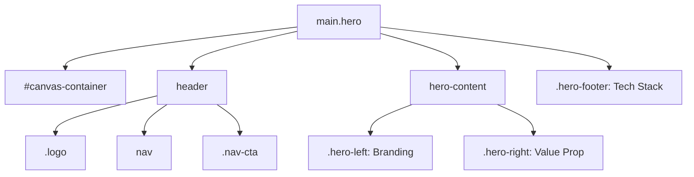

# 🧠 Explain My App: Hero Section

Welcome to the **Hero Section** analysis. This is the "face" of Aarna-AI, designed to communicate value instantly through a split-screen layout and immersive 3D technology.

## 1️⃣ Visual Mapping (The Skeleton)

The Hero section is defined in [main.js](file:///c:/Users/CSP/Desktop/Aarna-AI/src/main.js) and styled in [style.css](file:///c:/Users/CSP/Desktop/Aarna-AI/src/style.css).

### 🎯 Architectural Intent
- **Split Layout:** We use a 12-column grid. The left side (cols 1-4) handles "Who we are" (Branding). The right side (cols 9-12) handles "What we do" (Headline & CTA). The middle is intentionally empty to let the **Spline 3D Robot** breathe.
- **Immersion:** The Spline robot isn't a static image; it's a live 3D runtime loaded via `@splinetool/runtime`. It lives in `#canvas-container`, which is set to `z-index: 0` so text can float over it.

---

## 2️⃣ Plain-English Explanation (The Mentor View)

### [main.js](file:///c:/Users/CSP/Desktop/Aarna-AI/src/main.js)
This file is the **Brain** of your landing page. 
- **The HTML Template (Lines 61-187):** Instead of a static `index.html`, we generate the page dynamically. This allows us to inject data (like the tech stack logos) easily.
- **Spline Loader (Lines 189-213):** This block initializes the 3D scene. It creates a `<canvas>`, loads the scene from a URL, and fades it in once ready.
  - *Mentor Note:* We use `opacity: 0` initially to prevent a "pop" effect if the model takes a second to load.

### [style.css](file:///c:/Users/CSP/Desktop/Aarna-AI/src/style.css)
This is the **Character** of your app.
- **Glassmorphism (Lines 137-161):** The header uses `backdrop-filter: blur(20px)`. This gives it that "frosted glass" look, making it feel premium and modern.
- **Pointer Events (Lines 230-247):** Notice `pointer-events: none` on the `.hero` container. This is a clever trick! It allows clicks to "pass through" the empty space so users can still rotate the 3D robot, while `pointer-events: auto` on buttons lets them still be clickable.

---

## 3️⃣ Dependency & Change Impact (The Magic)

### ⚠️ If you change this...
**1. `grid-template-columns` in `.hero-split-layout`**
- **Impact:** This governs the horizontal distribution. If you make the `.hero-left` wider (e.g., `span 6`), it might collide with the 3D robot in the center.
- **Fix:** You must adjust the columns for both `.hero-left` and `.hero-right` to maintain the "gutter" for the 3D model.

**2. Header `position: absolute`**
- **Impact:** The header is detached from the document flow. If you add more content *above* the hero, the header will overlap it.
- **Fix:** You'd need to change header to `sticky` or increase the `top` margin of the hero content.

**3. Spline Scene URL**
- **Impact:** This is the heartbeat of the design. Changing this URL will instantly swap the 3D asset.
- **Fix:** Ensure the new asset is centered in Spline; otherwise, it might hide behind your text.

### 🔗 Connected To
- **`index.html`:** The entire JS bundle mounts to `
`. If you change the ID in HTML, the app won't render.
- **Custom Fonts:** The "Forzon" and "GT Super" fonts are defined at the top of CSS. Changing these variables (`--font-branding`, `--font-primary`) will instantly transform the "AI/Premium" vibe of the site.

---

## 4️⃣ Why does this exist? (Intent)
- **Why the Marquee?** The tech stack scroller at the bottom (`.hero-footer`) builds instant "authority." It shows you use credible tools like OpenAI and Anthropic.
- **Why the "Let's Talk" ↗ button?** The arrow icon (↗) is a subtle UX hint that this action might open a new modal or scroll to a specific section—it's an invitation to interact.
